# Reverse Proxy

## Architecture

```mermaid
graph TD
  A[Request from Internet] --> B[DNS Resolution - Cloudflare]
  B -->|*.internal| C[Tailscale DNS → Your Machine IP]
  C --> D["Caddy (Ports 80/443)"]
  D --> E["Local Services"]
  B -->|"other domains"| F["Cloudflare Tunnel (Proxy)"]
  F --> G[Nginx Reverse Proxy]
  G --> E
```

## HTTPS

Caddy is used as reverse proxy for my internal services. Also, it handles https.

Nginx is used as reverse proxy for my public services. HTTPS in this case is handled by cloudflare itself.

## DNS

dnsmasq can be used if mapping requests from the host based on an internal URL like x.bso.internal.

## SSH

Services listening to SSH connections will have their ports exposed on host. Nginx stream configuration (and TCP protocol itself) can't handle forwarding based on subdomains, so they must be separated ports anyway.
